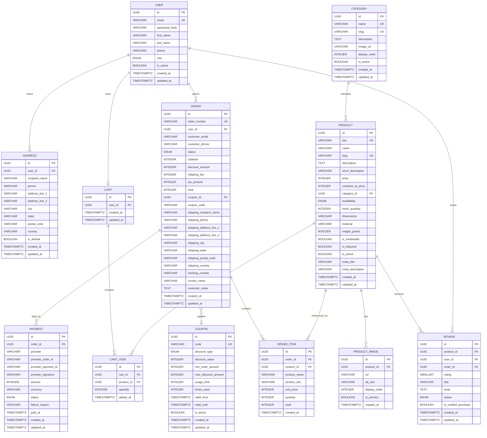

# Database Architecture & Domain Model

This document is the authoritative source of truth for the Mandala Art Store's data model, entity relationships, constraints, and persistence strategies. Any AI agent modifying the database schema must read this document first and update it after changes.

---

## 1. Design Philosophy

> **"Model the business we actually have, not the business we might have someday."**

This database serves a small handmade-art ecommerce business selling Mandala Art, Lippan Art, and handmade paintings primarily to customers in India. The schema must be:

- **Minimal**: Only entities the business genuinely needs to operate.
- **Correct**: Financial data, inventory, and order history must be authoritative and consistent.
- **Extensible**: New product categories or attributes can be added without restructuring core tables.
- **Simple**: No microservice event stores, no generic EAV attribute systems, no multi-tenant abstractions.

---

## 2. Domain Classification

| Domain                      | Classification    | Rationale                                                                                                                                                              |
| :-------------------------- | :---------------- | :--------------------------------------------------------------------------------------------------------------------------------------------------------------------- |
| **Product**                 | REQUIRED NOW      | Core of the catalog; must exist for any store operation.                                                                                                               |
| **Category**                | REQUIRED NOW      | Products must be browsable by art type. Data-driven, admin-managed.                                                                                                    |
| **Product Image**           | REQUIRED NOW      | Art business is image-heavy. Multiple images per product with ordering.                                                                                                |
| **User (Customer + Admin)** | REQUIRED NOW      | Unified user table with role field. Required for auth, orders, and admin access.                                                                                       |
| **Address**                 | REQUIRED NOW      | Customers need shipping addresses for checkout.                                                                                                                        |
| **Order**                   | REQUIRED NOW      | Core transactional record. Must preserve historical pricing snapshots.                                                                                                 |
| **Order Item**              | REQUIRED NOW      | Line items within an order, each a snapshot of the purchased product at time of purchase.                                                                              |
| **Payment**                 | REQUIRED NOW      | Records payment gateway transactions linked to orders. No sensitive card data stored.                                                                                  |
| **Cart**                    | REQUIRED NOW      | Server-side cart for authenticated users. Guest cart lives in localStorage until login/signup.                                                                         |
| **Cart Item**               | REQUIRED NOW      | Individual items within a cart.                                                                                                                                        |
| **Review**                  | REQUIRED SOON     | Important for trust and social proof, but not blocking for MVP launch. Design now, implement soon after core purchase flow.                                            |
| **Coupon**                  | REQUIRED SOON     | Simple coupon codes for promotions. Not needed for day-one launch but important for growth. Design now, implement alongside checkout.                                  |
| **Wishlist**                | OPTIONAL / FUTURE | Nice-to-have. A simple junction table (user_id, product_id). Defer until core purchase flow is solid.                                                                  |
| **Product Variants**        | OPTIONAL / FUTURE | Currently each artwork is uniquely listed. A generic variant engine is premature. Defer until the business explicitly needs size/material variants. See Section 8.     |
| **Shipping Entity**         | NOT REQUIRED      | Shipping metadata (address snapshot, fee, tracking number) is embedded directly into the Order. A separate shipping table adds complexity without value at this scale. |
| **Audit Log**               | OPTIONAL / FUTURE | Admin action tracking. Recommended for price and inventory changes eventually, but not a launch requirement.                                                           |

---

## 3. Entity Definitions

### 3.1 User

Represents both registered customers and administrators in a single table, differentiated by `role`.

| Field           | Type                      | Constraints                  | Notes                                                         |
| :-------------- | :------------------------ | :--------------------------- | :------------------------------------------------------------ |
| `id`            | UUID                      | PK, auto-generated           | Default `gen_random_uuid()`                                   |
| `email`         | VARCHAR(255)              | UNIQUE, NOT NULL             | Login identifier. Lowercase, trimmed.                         |
| `password_hash` | VARCHAR(255)              | NOT NULL                     | Bcrypt (cost 12) or Argon2id hash. **Never** store plaintext. |
| `first_name`    | VARCHAR(100)              | NOT NULL                     |                                                               |
| `last_name`     | VARCHAR(100)              | NOT NULL                     |                                                               |
| `phone`         | VARCHAR(20)               | NULLABLE                     | Indian mobile number (+91 / 10-digit format).                 |
| `role`          | ENUM('customer', 'admin') | NOT NULL, DEFAULT 'customer' | Admin role grants access to protected admin API routes.       |
| `is_active`     | BOOLEAN                   | NOT NULL, DEFAULT true       | Soft-disable accounts without deletion.                       |
| `created_at`    | TIMESTAMPTZ               | NOT NULL, DEFAULT NOW()      |                                                               |
| `updated_at`    | TIMESTAMPTZ               | NOT NULL, DEFAULT NOW()      |                                                               |

**Why a single User table?** At this boutique scale, a separate `Admin` table creates unnecessary complexity. Role-based access control is enforced in backend middleware via verified JWT tokens.

---

### 3.2 Category

Admin-managed, data-driven product groupings.

| Field           | Type         | Constraints             | Notes                                                                                  |
| :-------------- | :----------- | :---------------------- | :------------------------------------------------------------------------------------- |
| `id`            | UUID         | PK, auto-generated      |                                                                                        |
| `name`          | VARCHAR(100) | UNIQUE, NOT NULL        | e.g., "Mandala Art", "Lippan Art", "Handmade Paintings"                                |
| `slug`          | VARCHAR(120) | UNIQUE, NOT NULL        | URL-safe identifier: `mandala-art`, `lippan-art`                                       |
| `description`   | TEXT         | NULLABLE                | Brief category description for SEO and storefront display.                             |
| `image_url`     | VARCHAR(500) | NULLABLE                | Category banner/thumbnail hosted on CDN.                                               |
| `display_order` | INTEGER      | NOT NULL, DEFAULT 0     | Controls sort order in storefront navigation.                                          |
| `is_active`     | BOOLEAN      | NOT NULL, DEFAULT true  | Inactive categories are hidden from storefront but retained for historical references. |
| `created_at`    | TIMESTAMPTZ  | NOT NULL, DEFAULT NOW() |                                                                                        |
| `updated_at`    | TIMESTAMPTZ  | NOT NULL, DEFAULT NOW() |                                                                                        |

**Flat hierarchy**: Categories are a single flat level (not nested/tree). The boutique catalog has ~4–6 primary art categories. Nested trees add unnecessary recursive query complexity.

---

### 3.3 Product

The core catalog entity. Each row represents one distinct artwork listing.

| Field               | Type                                          | Constraints                                      | Notes                                                                                                              |
| :------------------ | :-------------------------------------------- | :----------------------------------------------- | :----------------------------------------------------------------------------------------------------------------- |
| `id`                | UUID                                          | PK, auto-generated                               |                                                                                                                    |
| `sku`               | VARCHAR(50)                                   | UNIQUE, NOT NULL                                 | Stock keeping unit: e.g., `MND-DOT-001`, `LPN-PEA-002`.                                                            |
| `name`              | VARCHAR(200)                                  | NOT NULL                                         | Display title: "Golden Mandala on Black Canvas".                                                                   |
| `slug`              | VARCHAR(220)                                  | UNIQUE, NOT NULL                                 | URL-safe identifier for SEO-friendly product URLs.                                                                 |
| `description`       | TEXT                                          | NOT NULL                                         | Full product description (technique, materials, care instructions).                                                |
| `short_description` | VARCHAR(500)                                  | NULLABLE                                         | Brief tagline for catalog cards and search previews.                                                               |
| `price`             | INTEGER                                       | NOT NULL, CHECK (price >= 0)                     | Price in **paise** (INR minor units). ₹1,499 = `149900`.                                                           |
| `compare_at_price`  | INTEGER                                       | NULLABLE, CHECK (compare_at_price >= 0)          | Original/MRP in paise, shown crossed-out if higher than `price`.                                                   |
| `category_id`       | UUID                                          | FK → Category.id, NOT NULL, ON DELETE RESTRICT   | Each product belongs to exactly one category.                                                                      |
| `availability`      | ENUM('in_stock', 'made_to_order', 'sold_out') | NOT NULL, DEFAULT 'in_stock'                     | Governs purchasability. `sold_out` items are visible in gallery but not addable to cart.                           |
| `stock_quantity`    | INTEGER                                       | NOT NULL, DEFAULT 0, CHECK (stock_quantity >= 0) | Available physical units. For 1-of-1 art, `stock_quantity = 1`. For made-to-order, represents production capacity. |
| `dimensions`        | VARCHAR(100)                                  | NULLABLE                                         | Free text: e.g., "12 × 12 inches", "30 × 30 cm".                                                                   |
| `material`          | VARCHAR(200)                                  | NULLABLE                                         | e.g., "Clay & mirrors on MDF board", "Acrylic on canvas".                                                          |
| `weight_grams`      | INTEGER                                       | NULLABLE, CHECK (weight_grams >= 0)              | Shipping weight in grams for logistics calculation.                                                                |
| `is_handmade`       | BOOLEAN                                       | NOT NULL, DEFAULT true                           | Highlights handcrafted authenticity.                                                                               |
| `is_featured`       | BOOLEAN                                       | NOT NULL, DEFAULT false                          | Admin-toggled for homepage highlights.                                                                             |
| `is_active`         | BOOLEAN                                       | NOT NULL, DEFAULT true                           | Soft-deactivation. Inactive products are hidden from storefront but preserved for orders.                          |
| `meta_title`        | VARCHAR(200)                                  | NULLABLE                                         | SEO title override (falls back to `name` if NULL).                                                                 |
| `meta_description`  | VARCHAR(500)                                  | NULLABLE                                         | SEO meta description override.                                                                                     |
| `created_at`        | TIMESTAMPTZ                                   | NOT NULL, DEFAULT NOW()                          |                                                                                                                    |
| `updated_at`        | TIMESTAMPTZ                                   | NOT NULL, DEFAULT NOW()                          |                                                                                                                    |

---

### 3.4 Product Image

Multiple images per artwork listing, with gallery sequencing and a designated primary thumbnail.

| Field           | Type         | Constraints                                  | Notes                                                         |
| :-------------- | :----------- | :------------------------------------------- | :------------------------------------------------------------ |
| `id`            | UUID         | PK, auto-generated                           |                                                               |
| `product_id`    | UUID         | FK → Product.id, NOT NULL, ON DELETE CASCADE | Deleting a product (draft) cascades to its images.            |
| `url`           | VARCHAR(500) | NOT NULL                                     | CDN URL from cloud image storage (Cloudinary).                |
| `alt_text`      | VARCHAR(200) | NULLABLE                                     | Accessible alt text for screen readers and SEO.               |
| `display_order` | INTEGER      | NOT NULL, DEFAULT 0                          | Sequence in gallery. Lowest number displayed first.           |
| `is_primary`    | BOOLEAN      | NOT NULL, DEFAULT false                      | Thumbnail for catalog grids. Exactly one primary per product. |
| `created_at`    | TIMESTAMPTZ  | NOT NULL, DEFAULT NOW()                      |                                                               |

---

### 3.5 Address

Customer saved shipping addresses for registered users.

| Field            | Type         | Constraints                               | Notes                                |
| :--------------- | :----------- | :---------------------------------------- | :----------------------------------- |
| `id`             | UUID         | PK, auto-generated                        |                                      |
| `user_id`        | UUID         | FK → User.id, NOT NULL, ON DELETE CASCADE | Owned by a registered customer.      |
| `recipient_name` | VARCHAR(150) | NOT NULL                                  | Name of person receiving package.    |
| `phone`          | VARCHAR(20)  | NOT NULL                                  | Delivery contact phone number.       |
| `address_line_1` | VARCHAR(255) | NOT NULL                                  | Street address, flat/house number.   |
| `address_line_2` | VARCHAR(255) | NULLABLE                                  | Landmark, apartment name, area.      |
| `city`           | VARCHAR(100) | NOT NULL                                  |                                      |
| `state`          | VARCHAR(100) | NOT NULL                                  | Indian state/union territory.        |
| `postal_code`    | VARCHAR(10)  | NOT NULL                                  | Indian PIN code (6 digits).          |
| `country`        | VARCHAR(50)  | NOT NULL, DEFAULT 'India'                 | Country name.                        |
| `is_default`     | BOOLEAN      | NOT NULL, DEFAULT false                   | User's default shipping destination. |
| `created_at`     | TIMESTAMPTZ  | NOT NULL, DEFAULT NOW()                   |                                      |
| `updated_at`     | TIMESTAMPTZ  | NOT NULL, DEFAULT NOW()                   |                                      |

> **Address Immutability Principle**: When an order is placed, address details are copied into **snapshot fields on the Order record**. If a customer edits or deletes their saved address in this table, historical orders remain 100% unchanged.

---

### 3.6 Cart & Cart Item

Shopping cart storage.

**Cart** (server-side for registered users):

| Field        | Type        | Constraints                                       | Notes                                        |
| :----------- | :---------- | :------------------------------------------------ | :------------------------------------------- |
| `id`         | UUID        | PK, auto-generated                                |                                              |
| `user_id`    | UUID        | FK → User.id, UNIQUE, NOT NULL, ON DELETE CASCADE | Exactly one active cart per registered user. |
| `created_at` | TIMESTAMPTZ | NOT NULL, DEFAULT NOW()                           |                                              |
| `updated_at` | TIMESTAMPTZ | NOT NULL, DEFAULT NOW()                           |                                              |

**Cart Item**:

| Field        | Type        | Constraints                                  | Notes               |
| :----------- | :---------- | :------------------------------------------- | :------------------ |
| `id`         | UUID        | PK, auto-generated                           |                     |
| `cart_id`    | UUID        | FK → Cart.id, NOT NULL, ON DELETE CASCADE    |                     |
| `product_id` | UUID        | FK → Product.id, NOT NULL, ON DELETE CASCADE |                     |
| `quantity`   | INTEGER     | NOT NULL, DEFAULT 1, CHECK (quantity >= 1)   | Quantity requested. |
| `added_at`   | TIMESTAMPTZ | NOT NULL, DEFAULT NOW()                      |                     |

**Constraint**: `UNIQUE (cart_id, product_id)` prevents duplicate lines for the same product in a cart.

**Guest Cart Strategy**:

- Guest visitors (unauthenticated) maintain their cart in browser `localStorage`.
- When a guest logs in or registers, the client sends their local items to `/api/cart/merge` to merge into their server cart.
- When an unauthenticated guest checks out directly (Guest Checkout), the client submits the cart items directly in the checkout payload.

---

### 3.7 Order

The core transactional financial and fulfillment record. Immutable after creation.

| Field                     | Type         | Constraints                                       | Notes                                                                   |
| :------------------------ | :----------- | :------------------------------------------------ | :---------------------------------------------------------------------- |
| `id`                      | UUID         | PK, auto-generated                                |                                                                         |
| `order_number`            | VARCHAR(30)  | UNIQUE, NOT NULL                                  | Human-readable reference: e.g., `MAS-20261004-0001`.                    |
| `user_id`                 | UUID         | FK → User.id, NULLABLE, ON DELETE RESTRICT        | `NULL` for guest checkout; references registered User if logged in.     |
| `customer_email`          | VARCHAR(255) | NOT NULL                                          | Contact email for order updates, receipts, and tracking.                |
| `customer_phone`          | VARCHAR(20)  | NOT NULL                                          | Contact phone for logistics communication.                              |
| `status`                  | ENUM         | NOT NULL, DEFAULT 'pending_payment'               | Lifecycle state (see Section 5).                                        |
| `subtotal`                | INTEGER      | NOT NULL, CHECK (subtotal >= 0)                   | Sum of item totals in paise before discounts/shipping/tax.              |
| `discount_amount`         | INTEGER      | NOT NULL, DEFAULT 0, CHECK (discount_amount >= 0) | Total discount applied in paise.                                        |
| `shipping_fee`            | INTEGER      | NOT NULL, DEFAULT 0, CHECK (shipping_fee >= 0)    | Shipping charge in paise.                                               |
| `tax_amount`              | INTEGER      | NOT NULL, DEFAULT 0, CHECK (tax_amount >= 0)      | Applicable tax in paise.                                                |
| `total`                   | INTEGER      | NOT NULL, CHECK (total >= 0)                      | Final payable amount in paise (`subtotal - discount + shipping + tax`). |
| `coupon_id`               | UUID         | FK → Coupon.id, NULLABLE, ON DELETE SET NULL      | Applied coupon reference.                                               |
| `coupon_code`             | VARCHAR(50)  | NULLABLE                                          | Snapshot of coupon code at order placement.                             |
| `shipping_recipient_name` | VARCHAR(150) | NOT NULL                                          | Snapshot of recipient name at time of order.                            |
| `shipping_phone`          | VARCHAR(20)  | NOT NULL                                          | Snapshot of delivery phone number.                                      |
| `shipping_address_line_1` | VARCHAR(255) | NOT NULL                                          | Snapshot of street address.                                             |
| `shipping_address_line_2` | VARCHAR(255) | NULLABLE                                          | Snapshot of landmark / unit details.                                    |
| `shipping_city`           | VARCHAR(100) | NOT NULL                                          | Snapshot of city.                                                       |
| `shipping_state`          | VARCHAR(100) | NOT NULL                                          | Snapshot of state.                                                      |
| `shipping_postal_code`    | VARCHAR(10)  | NOT NULL                                          | Snapshot of 6-digit PIN code.                                           |
| `shipping_country`        | VARCHAR(50)  | NOT NULL, DEFAULT 'India'                         | Snapshot of country.                                                    |
| `tracking_number`         | VARCHAR(100) | NULLABLE                                          | Logistics tracking number entered by admin upon dispatch.               |
| `courier_name`            | VARCHAR(100) | NULLABLE                                          | Courier partner name (e.g., Delhivery, India Post).                     |
| `customer_notes`          | TEXT         | NULLABLE                                          | Delivery instructions or custom requests.                               |
| `created_at`              | TIMESTAMPTZ  | NOT NULL, DEFAULT NOW()                           | Order placement timestamp.                                              |
| `updated_at`              | TIMESTAMPTZ  | NOT NULL, DEFAULT NOW()                           | Last status update timestamp.                                           |

---

### 3.8 Order Item

Snapshot line items within an order. Fully immutable.

| Field          | Type         | Constraints                                   | Notes                                                                       |
| :------------- | :----------- | :-------------------------------------------- | :-------------------------------------------------------------------------- |
| `id`           | UUID         | PK, auto-generated                            |                                                                             |
| `order_id`     | UUID         | FK → Order.id, NOT NULL, ON DELETE CASCADE    | Parent order.                                                               |
| `product_id`   | UUID         | FK → Product.id, NULLABLE, ON DELETE SET NULL | Catalog product reference (preserved even if product is later deactivated). |
| `product_name` | VARCHAR(200) | NOT NULL                                      | Snapshot of product title at purchase time.                                 |
| `product_sku`  | VARCHAR(50)  | NOT NULL                                      | Snapshot of SKU at purchase time.                                           |
| `unit_price`   | INTEGER      | NOT NULL, CHECK (unit_price >= 0)             | Unit price in paise charged at purchase time.                               |
| `quantity`     | INTEGER      | NOT NULL, CHECK (quantity >= 1)               | Number of units purchased.                                                  |
| `total`        | INTEGER      | NOT NULL, CHECK (total >= 0)                  | Line total in paise (`unit_price * quantity`).                              |
| `created_at`   | TIMESTAMPTZ  | NOT NULL, DEFAULT NOW()                       |                                                                             |

---

### 3.9 Payment

Records payment gateway transactions linked to orders.

| Field                 | Type                                                            | Constraints                                 | Notes                                                      |
| :-------------------- | :-------------------------------------------------------------- | :------------------------------------------ | :--------------------------------------------------------- |
| `id`                  | UUID                                                            | PK, auto-generated                          |                                                            |
| `order_id`            | UUID                                                            | FK → Order.id, NOT NULL, ON DELETE RESTRICT | Associated order.                                          |
| `provider`            | VARCHAR(50)                                                     | NOT NULL, DEFAULT 'razorpay'                | Payment gateway provider.                                  |
| `provider_order_id`   | VARCHAR(100)                                                    | NULLABLE                                    | Gateway order identifier (e.g. `order_xyz123`).            |
| `provider_payment_id` | VARCHAR(100)                                                    | NULLABLE                                    | Gateway payment identifier (e.g. `pay_xyz123`).            |
| `provider_signature`  | VARCHAR(255)                                                    | NULLABLE                                    | Cryptographic signature for webhook/callback verification. |
| `amount`              | INTEGER                                                         | NOT NULL, CHECK (amount >= 0)               | Transaction amount in paise.                               |
| `currency`            | VARCHAR(3)                                                      | NOT NULL, DEFAULT 'INR'                     | ISO currency code.                                         |
| `status`              | ENUM('pending', 'authorized', 'captured', 'failed', 'refunded') | NOT NULL, DEFAULT 'pending'                 | Gateway transaction status.                                |
| `failure_reason`      | VARCHAR(500)                                                    | NULLABLE                                    | Error message from gateway if transaction failed.          |
| `paid_at`             | TIMESTAMPTZ                                                     | NULLABLE                                    | Timestamp when payment was verified.                       |
| `created_at`          | TIMESTAMPTZ                                                     | NOT NULL, DEFAULT NOW()                     |                                                            |
| `updated_at`          | TIMESTAMPTZ                                                     | NOT NULL, DEFAULT NOW()                     |                                                            |

> **Security Guarantee**: The backend never receives, processes, or stores credit/debit card numbers, CVVs, expiry dates, or UPI PINs. All sensitive credentials are processed exclusively through Razorpay's PCI-DSS compliant checkout modal.

---

### 3.10 Review

Customer ratings and reviews on artworks.

| Field                  | Type                                    | Constraints                                   | Notes                                                                     |
| :--------------------- | :-------------------------------------- | :-------------------------------------------- | :------------------------------------------------------------------------ |
| `id`                   | UUID                                    | PK, auto-generated                            |                                                                           |
| `product_id`           | UUID                                    | FK → Product.id, NOT NULL, ON DELETE CASCADE  | Target artwork.                                                           |
| `user_id`              | UUID                                    | FK → User.id, NOT NULL, ON DELETE CASCADE     | Author of the review.                                                     |
| `order_id`             | UUID                                    | FK → Order.id, NULLABLE, ON DELETE SET NULL   | Associated order for verified purchase badge.                             |
| `rating`               | SMALLINT                                | NOT NULL, CHECK (rating >= 1 AND rating <= 5) | Star rating (1–5).                                                        |
| `title`                | VARCHAR(200)                            | NULLABLE                                      | Optional review headline.                                                 |
| `body`                 | TEXT                                    | NULLABLE                                      | Review text (sanitized against XSS before storage).                       |
| `status`               | ENUM('pending', 'approved', 'rejected') | NOT NULL, DEFAULT 'pending'                   | Admin moderation. Only `approved` reviews are shown on storefront.        |
| `is_verified_purchase` | BOOLEAN                                 | NOT NULL, DEFAULT false                       | Automatically true if `order_id` links to a delivered order by this user. |
| `created_at`           | TIMESTAMPTZ                             | NOT NULL, DEFAULT NOW()                       |                                                                           |
| `updated_at`           | TIMESTAMPTZ                             | NOT NULL, DEFAULT NOW()                       |                                                                           |

**Constraint**: `UNIQUE (product_id, user_id)` ensures one review per customer per product.

---

### 3.11 Coupon

Simple promotional discount codes.

| Field                 | Type                               | Constraints                                  | Notes                                                                 |
| :-------------------- | :--------------------------------- | :------------------------------------------- | :-------------------------------------------------------------------- |
| `id`                  | UUID                               | PK, auto-generated                           |                                                                       |
| `code`                | VARCHAR(50)                        | UNIQUE, NOT NULL                             | Uppercase code: e.g., `WELCOME10`, `DIWALI500`.                       |
| `discount_type`       | ENUM('percentage', 'fixed_amount') | NOT NULL                                     | Discount computation mode.                                            |
| `discount_value`      | INTEGER                            | NOT NULL, CHECK (discount_value > 0)         | Percentage (e.g., `10` = 10%) or Paise amount (e.g., `50000` = ₹500). |
| `min_order_amount`    | INTEGER                            | NULLABLE, CHECK (min_order_amount >= 0)      | Minimum subtotal in paise to qualify.                                 |
| `max_discount_amount` | INTEGER                            | NULLABLE, CHECK (max_discount_amount >= 0)   | Maximum discount cap in paise for percentage coupons.                 |
| `usage_limit`         | INTEGER                            | NULLABLE, CHECK (usage_limit >= 0)           | Maximum total redemptions allowed.                                    |
| `times_used`          | INTEGER                            | NOT NULL, DEFAULT 0, CHECK (times_used >= 0) | Incremented upon successful payment confirmation.                     |
| `valid_from`          | TIMESTAMPTZ                        | NOT NULL                                     | Start date/time.                                                      |
| `valid_until`         | TIMESTAMPTZ                        | NOT NULL                                     | End date/time.                                                        |
| `is_active`           | BOOLEAN                            | NOT NULL, DEFAULT true                       | Manual toggle by admin.                                               |
| `created_at`          | TIMESTAMPTZ                        | NOT NULL, DEFAULT NOW()                      |                                                                       |
| `updated_at`          | TIMESTAMPTZ                        | NOT NULL, DEFAULT NOW()                      |                                                                       |

---

## 4. Entity Relationship Diagram



---

## 5. Order & Payment Lifecycle

```
[ Customer Initiates Checkout ]
            │
            ▼ (Atomic stock reservation in DB transaction)
  [ pending_payment ] ──(Razorpay payment success verified)──> [ confirmed ] ──> [ processing ] ──> [ shipped ] ──> [ delivered ]
            │                                                              │
            ├──(Payment failed / aborted / 15-min TTL timeout)             │
            │   │                                                          ▼ (Admin cancellation before dispatch)
            │   ▼ (Immediate atomic stock release compensation)      [ cancelled ] ──(Refund logged in Payment)
            │ [ payment_failed / cancelled ] (Terminal)
            │   │
            ▼   └──(Customer trying again must initiate a NEW checkout with fresh stock reservation)
      [ cancelled ] (Terminal)
```

### Valid Transition Map & Stock Actions

| From Status       | Allowed Target Statuses | Trigger / Actor                              | Inventory Action                                                 |
| :---------------- | :---------------------- | :------------------------------------------- | :--------------------------------------------------------------- |
| `pending_payment` | `confirmed`             | Razorpay webhook / verified signature        | **Retain stock decrement**; order locked against edits.          |
| `pending_payment` | `payment_failed`        | Gateway rejection / webhook `payment.failed` | **Release reserved stock immediately**; order state is terminal. |
| `pending_payment` | `cancelled`             | Customer abort / 15-min TTL expiration       | **Release reserved stock immediately**; order state is terminal. |
| `payment_failed`  | _(Terminal State)_      | Payment failed                               | No further transitions. New checkout required.                   |
| `confirmed`       | `processing`            | Admin starts packing or crafting             | No inventory change (stock already deducted).                    |
| `confirmed`       | `cancelled`             | Admin cancels before dispatch                | **Release stock** back to inventory; trigger gateway refund.     |
| `processing`      | `shipped`               | Admin generates tracking & hands to courier  | No inventory change.                                             |
| `shipped`         | `delivered`             | Courier delivery confirmation / Admin update | No inventory change.                                             |
| `delivered`       | _(Terminal State)_      | Fulfillment complete                         | Permanent final state.                                           |
| `cancelled`       | _(Terminal State)_      | Terminal state                               | Permanent final state.                                           |

---

## 6. Money Representation Strategy

- **Integer Paise Representation**: All monetary columns (`price`, `compare_at_price`, `subtotal`, `discount_amount`, `shipping_fee`, `tax_amount`, `total`, `unit_price`, `amount`) are stored as **INTEGER in paise** (INR minor units).
- **Rule**: ₹1,499.00 = `149900` paise. ₹500.00 discount = `50000` paise. ₹0.00 = `0` paise.
- **Constraints**: Database-level `CHECK (column_name >= 0)` ensures non-negative amounts.
- **Display**: Frontend helper `formatPrice(paise)` formats to `₹1,499` or `₹1,499.00` using Indian numbering format.

---

## 7. Inventory & Concurrency Strategy

Inventory management for this handmade art business operates under a strict, simple **Atomic Reservation & Immediate Compensation** model:

### 1. Atomic Stock Reservation (Checkout Initiation)

When checkout is initiated (`POST /api/orders/checkout`), the backend executes a database transaction:

- **For `in_stock` items** (including unique 1-of-1 pieces with `stock_quantity = 1`):
  ```sql
  UPDATE products
  SET stock_quantity = stock_quantity - :qty,
      availability = CASE WHEN stock_quantity - :qty = 0 THEN 'sold_out'::availability_enum ELSE availability END
  WHERE id = :id AND stock_quantity >= :qty AND is_active = true AND availability = 'in_stock'::availability_enum;
  ```
  If the `UPDATE` affects 0 rows, the transaction rolls back immediately and checkout is rejected with `"Item out of stock or currently reserved by another buyer"`. This strictly prevents race conditions and guarantees two buyers cannot purchase the same unique art piece simultaneously.
- **For `made_to_order` items**:
  No stock decrement is performed (`availability = 'made_to_order'`). The product remains purchasable without depleting stock.
- Creates `Order` with `status = 'pending_payment'`, `Payment` with `status = 'pending'`, and generates the Razorpay `order_id`.

### 2. Payment Success (Retention)

Upon receipt of a valid Razorpay webhook or verified callback signature:

- Order transitions: `pending_payment` → `confirmed`.
- Payment transitions: `pending` → `captured` (recording `paid_at`, `provider_payment_id`, `provider_signature`).
- Stock decrement remains permanent.

### 3. Payment Failure, Cancellation, or TTL Expiration (Immediate Stock Release)

If payment fails, is cancelled by customer, or the reservation TTL (15 minutes) expires:

- Order transitions: `pending_payment` → `payment_failed` or `cancelled` (terminal states for that order attempt).
- Payment transitions: `pending` → `failed`.
- The backend immediately executes an atomic compensation query within a database transaction:
  ```sql
  UPDATE products
  SET stock_quantity = stock_quantity + :qty,
      availability = CASE WHEN availability = 'sold_out'::availability_enum THEN 'in_stock'::availability_enum ELSE availability END
  WHERE id = :id AND availability != 'made_to_order'::availability_enum;
  ```
- **Re-attempt Policy**: If the customer wishes to try purchasing again after a failed/cancelled payment, they must start a **fresh checkout session** which creates a new order and attempts a fresh atomic stock reservation. This keeps the state machine trivial, prevents race conditions, and eliminates complex reservation management subsystems.

### 4. Made-to-Order Products

- `availability = 'made_to_order'` items are handcrafted upon order receipt.
- Stock quantity never blocks order placement unless the artisan explicitly defines a maximum batch capacity limit.

### 5. Backend Authority

- Frontend calculations are never trusted. All price totals, discounts, stock availability, Razorpay webhook signature verification, and inventory release logic are strictly executed and validated on the backend.

---

## 8. Product Variants Strategy

- **Decision**: Deferred for MVP.
- **Reasoning**: Each handmade artwork is currently listed as a distinct piece with its own dimensions, photos, SKU, and price. Adding a multi-dimensional variant engine (size × framing × finish) at this stage introduces unneeded complexity.

---

## 9. Image Storage Strategy

- **Database**: Stores only CDN URLs, alt text, gallery order, and primary flag in `ProductImage` and `Category.image_url`.
- **Object Storage**: High-resolution image files are stored in cloud object storage (Cloudinary) with automatic format optimization (WebP/AVIF), responsive breakpoint delivery, and CDN caching.

---

## 10. Authentication & Authorization Data Strategy

- **Unified User Table**: Both customers and admins reside in `User`, differentiated by `role`.
- **Password Security**: Bcrypt / Argon2id hashes in `password_hash`. Plaintext passwords never stored.
- **Authorization**: Protected admin routes require verified JWT with `role === 'admin'`.

---

## 11. Soft Delete Strategy

| Entity                | Delete Strategy                   | Integrity Rationale                                                            |
| :-------------------- | :-------------------------------- | :----------------------------------------------------------------------------- |
| **Product**           | Soft delete (`is_active = false`) | Historical orders reference products. Hard delete breaks invoice records.      |
| **Category**          | Soft delete (`is_active = false`) | Products reference categories. Hard delete orphans products.                   |
| **User**              | Soft delete (`is_active = false`) | Orders and reviews reference users. Hard delete breaks legal records.          |
| **Cart / CartItem**   | Hard delete                       | Transient shopping state with zero historical value.                           |
| **Address**           | Hard delete                       | Saved address book entries; historical orders have embedded address snapshots. |
| **Order / OrderItem** | Never delete                      | Permanent financial, tax, and fulfillment records.                             |
| **Payment**           | Never delete                      | Permanent financial audit log.                                                 |
| **Coupon**            | Soft delete (`is_active = false`) | Preserves historical coupon usage audit.                                       |

---

## 12. Database Technology Decision

- **Chosen ORM**: **Prisma ORM** with **PostgreSQL**.
- **Fit**:
  - Full TypeScript type safety with auto-generated types.
  - Clear, readable `.prisma` schema acting as single source of truth for humans and AI agents.
  - Robust versioned database migration tooling (`prisma migrate`).
  - Seamless match for modular monolith architecture.
- **Installation**: Deferred to Step 4.
